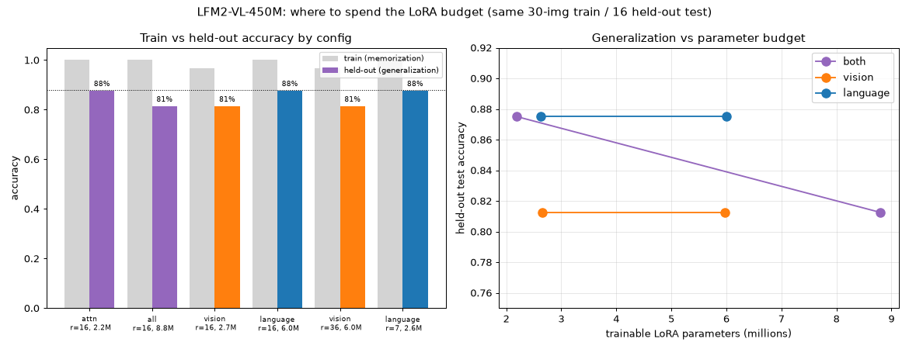

<!---
Copyright 2026 The HuggingFace Team. All rights reserved.

Licensed under the Apache License, Version 2.0 (the "License");
you may not use this file except in compliance with the License.
You may obtain a copy of the License at

    http://www.apache.org/licenses/LICENSE-2.0

Unless required by applicable law or agreed to in writing, software
distributed under the License is distributed on an "AS IS" BASIS,
WITHOUT WARRANTIES OR CONDITIONS OF ANY KIND, either express or implied.
See the License for the specific language governing permissions and
limitations under the License.
-->

# Where should the LoRA budget go? (component / target-module ablation)

`ablation_components.py` fine-tunes LFM2-VL-450M with several LoRA configurations on the
**same** 30-image training set and the **same** 16-image held-out test set of *unseen*
combinations (built by `finetune_lfm2_vl.build_demo_split`). It isolates two questions:

1. Does targeting **all** transformer linears (attention + LFM2 conv + MLP) beat the lean
   attention-only target?
2. Is fine-tuning the **language model** more effective than the **vision tower** — and
   does that still hold at an *equal trainable-parameter budget*?

Reproduce with (CPU is fine; ~1h for all six runs):

```bash
python examples/lfm2_vl_finetuning/ablation_components.py
```

## Results

All runs: rank-`r` LoRA, `lora_alpha=2r`, 10 epochs, lr 2e-4, identical data/seed.
"train" = accuracy on the 30 training images (memorization); "test" = accuracy on the 16
**unseen** combinations (generalization); `med ΔW` = median `||ΔW||/||W||` over adapted layers.

| config | what it adapts | rank | params | train | **test** | med ΔW |
| --- | --- | ---: | ---: | ---: | ---: | ---: |
| `attn_both`    | attention only, vision+language     | 16 | 2.20M | 100% | **88%** | 0.023 |
| `all_both`     | all linears, vision+language        | 16 | 8.80M | 100% | **81%** | 0.016 |
| `vision_all`   | all linears, **vision only**        | 16 | 2.65M |  97% | **81%** | 0.020 |
| `language_all` | all linears, **language only**      | 16 | 6.00M | 100% | **88%** | 0.014 |
| `vision_all`   | all linears, **vision only**        | 36 | 5.97M |  97% | **81%** | 0.027 |
| `language_all` | all linears, **language only**      |  7 | 2.62M | 100% | **88%** | 0.011 |



## Takeaways

**1. More target modules ≠ better — on a tiny dataset it overfits.** Going from attention-only
(`attn_both`, 2.2M params, **88%** test) to every linear (`all_both`, 8.8M params) *lowered*
held-out accuracy to **81%** while driving training loss closer to zero. Extra adapter capacity
was spent memorizing the 30 training images. So the original "incomplete" target list (attention
only) was actually the better-regularized choice here; the leaner adapter generalizes better.

**2. The language model is where adaptation matters — confirmed at equal budget.**
`language_all` reaches **88%** test and fits the training set perfectly; `vision_all` tops out at
**81%** and *cannot even fit the training set* (train 97%, loss stuck ≈ 2.3–2.5). This holds at
**both** parameter budgets:

- at ~2.6M params: language (r=7) **88%** vs vision (r=16) **81%**
- at ~6.0M params: language (r=16) **88%** vs vision (r=36) **81%**

Giving the vision tower *more* parameters (r=16 → r=36) did not move it off 81%. The reason is
structural: with the language head frozen, editing visual features alone can't change the output
distribution enough to fit the task — whereas the language model can. This matches the weight-change
analysis in the notebook, where an *unconstrained* fine-tune naturally put a larger relative update
into the language model (≈3.7%) than the vision tower (≈2.4%).

**Practical guidance:** for adapting LFM2-VL to a new text/answer behavior on little data, spend the
LoRA budget on the **language model** (even a small rank), and keep the adapter lean to avoid
overfitting. Re-target the vision tower only when the task needs genuinely new *visual* features.

> Caveat: these are small CPU-scale runs on a synthetic task; absolute numbers will shift with more
> data, epochs, and a real GPU. The *relative ordering* — lean-language > everything, vision-only
> worst — is the transferable lesson.
