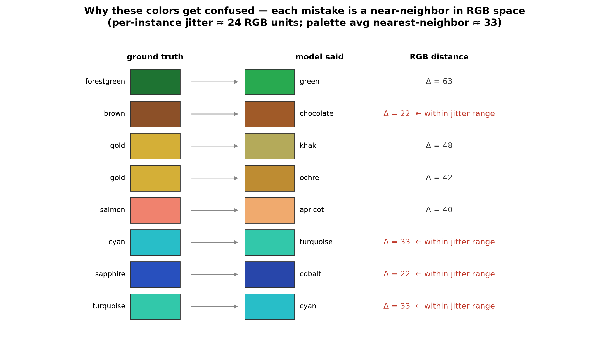

<!---
Copyright 2026 The HuggingFace Team. All rights reserved.
Licensed under the Apache License, Version 2.0 (the "License").
-->

# Why exactly *these* colors don't get learned

The [error analysis](./ERROR_ANALYSIS.md) showed that almost every held-out mistake is a color
confusion. Looking at *which* colors get swapped explains why — and why adding vision capacity/data
(not language) is the fix.

Every confusion is a **perceptual near-neighbor** (RGB distances below; palette average
nearest-neighbor ≈ 33; per-instance jitter ≈ 24 RGB units):

| ground truth → prediction | RGB distance | note |
| --- | ---: | --- |
| sapphire → cobalt | 22 | cobalt is sapphire's *nearest* neighbor |
| brown → chocolate | 22 | within jitter range |
| cyan → turquoise / turquoise → cyan | 33 | within jitter range |
| salmon → apricot | 40 | |
| gold → ochre / khaki | 42 / 48 | |
| forestgreen → green | 63 | swapped for the *prototype* name |

Four compounding causes:

1. **The classes are intrinsically close.** With 62 named colors the palette is dense — the average
   color sits only ~33 RGB units from its nearest neighbor. Every error swaps a color for one of these
   neighbors, never for an unrelated color.

2. **Jitter makes neighboring classes overlap.** Training adds per-instance Gaussian color noise
   (σ=14/channel ≈ 24 RGB RMS). For pairs separated by ~20-35 units (sapphire/cobalt, brown/chocolate,
   cyan/turquoise) the jittered distributions **overlap**, so some samples are genuinely ambiguous —
   part of the error is irreducible *by design* (we made the task hard on purpose).

3. **Frozen-encoder information bottleneck.** SigLIP2 is trained for semantic image–text matching, not
   precise colorimetry, and the pixel-unshuffle connector pools the image into few tokens — fine color
   nuance is compressed away. When the encoder is frozen (language-only), that lost detail is
   unrecoverable, which is why language-only makes the most color errors (13) and adapting the vision
   encoder reduces them (→ 7). The LM can only relabel what the encoder preserved.

4. **The language head falls back to prototype / higher-frequency names.** Among near-synonyms
   (green/forestgreen/emerald/seagreen, blue/navy/cobalt/sapphire/cerulean) the model emits the common,
   shorter, more frequent token — `forestgreen → "green"`, `turquoise → "cyan"`. Rare compound color
   names are also split into more sub-word tokens, making them harder to produce.

**So the model didn't "fail to learn colors" — it learned them up to the resolution its frozen eyes and
the overlapping labels allow.** The two things that help are exactly the ones our other experiments
flagged: **adapt the vision encoder** (recover fine color features) and **give it more data** (enough
samples to carve boundaries between overlapping classes). Neither is a language-model problem.
