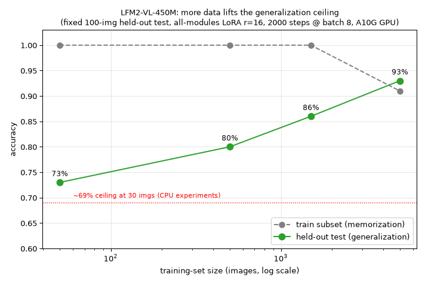

<!---
Copyright 2026 The HuggingFace Team. All rights reserved.

Licensed under the Apache License, Version 2.0 (the "License");
you may not use this file except in compliance with the License.
You may obtain a copy of the License at

    http://www.apache.org/licenses/LICENSE-2.0

Unless required by applicable law or agreed to in writing, software
distributed under the License is distributed on an "AS IS" BASIS,
WITHOUT WARRANTIES OR CONDITIONS OF ANY KIND, either express or implied.
See the License for the specific language governing permissions and
limitations under the License.
-->

# How far does more data push the generalization ceiling?

The rank sweep ([RANK_SWEEP.md](./RANK_SWEEP.md)) showed that, with only ~30 training images,
held-out accuracy on the harder task was bounded near **~69%** *regardless of model capacity* —
i.e. the bottleneck was **data, not capacity**. Here we test that directly by scaling the
training-set size against a **fixed held-out set of 100 unseen combinations**.

Config: all transformer linears, LoRA `r=16`; **fixed 2000 optimizer steps** at batch 8 (so
compute is constant across sizes — only the data seen changes); held-out test never overlaps any
training combination.

## Run on a GPU via [HF Jobs](https://huggingface.co/docs/huggingface_hub/guides/jobs)

This box is CPU-only, so the sweep was run on an Nvidia **A10G** through HF Jobs using the
self-contained UV script [`hf_job_size_sweep.py`](./hf_job_size_sweep.py) (inline PEP 723
dependencies; no repo checkout needed):

```bash
hf jobs uv run --flavor a10g-small --secrets HF_TOKEN hf_job_size_sweep.py
```

Each 2000-step run took ~18 min; the four-size sweep was ~70 min (≈ \$1.2 of A10G time). A
CPU-only, modular equivalent is [`data_size_sweep.py`](./data_size_sweep.py).

## Results

| train images | train subset (memorization) | **held-out test (generalization)** |
| ---: | ---: | ---: |
| 50   | 100% | 73% |
| 500  | 100% | 80% |
| 1500 | 100% | 86% |
| 5000 | 91%  | **93%** |



## Takeaways

**1. More data lifts the ceiling — a lot.** Held-out accuracy climbs **73% → 80% → 86% → 93%** as
training data grows 50 → 5000 (a ~20-point gain). The ~69–73% plateau seen with tiny data was
*not* a fundamental limit of the model or the LoRA capacity; it was simply data starvation. Scaling
the data ~100× nearly closes the gap to perfect.

**2. Memorization gives way to generalization.** Up to 1500 images the model still fits its training
subset perfectly (100%) while test accuracy lags — the classic overfitting gap. At 5000 images it
can no longer memorize everything in the fixed 2000-step budget (train subset drops to 91%), and at
that point **test (93%) actually exceeds the train subset (91%)**: the model is now *learning the
rule* rather than storing examples. The train/test gap closes from +27 points (at 50) to −2 (at 5000).

**3. This pins down the bottleneck across the whole study.** Earlier we saw capacity helps only the
vision encoder, and that adaptation concentrates in the language model. Here we see the *outer* limit:
on the hardest version of the task, the binding constraint for a fixed compute budget is the **amount
and diversity of training data**. The practical recipe — lean low-rank language-side LoRA + as much
diverse data as you can render/collect — follows directly.

> Caveat: fixed 2000-step budget means the largest run sees the data only ~3 epochs; with more steps
> the 5000-image point would likely climb further. Numbers are for this synthetic task on LFM2-VL-450M
> and will shift with scale, but the monotonic "more data → higher held-out accuracy, closing gap"
> trend is the transferable lesson.
