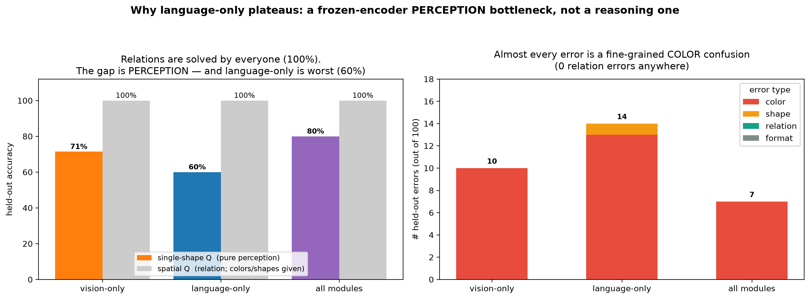

<!---
Copyright 2026 The HuggingFace Team. All rights reserved.
Licensed under the Apache License, Version 2.0 (the "License").
-->

# Why does language-only plateau? A frozen-encoder *perception* bottleneck

The rank sweep showed that at train=5000 `language-only` saturates at ~86% while adapting the
vision side reaches ~94%. To find out *why*, we categorize every held-out error by type
(color / shape / relation / format) for each component at r=16. Run on an A10G via HF Jobs with
[`hf_job_error_analysis.py`](./hf_job_error_analysis.py).

## Results (100-image held-out test, train=5000, r=16)

| component | test acc | single-shape Q (pure perception) | spatial Q (relation) | color errors | shape | relation | format |
| --- | ---: | ---: | ---: | ---: | ---: | ---: | ---: |
| vision-only   | 90% | 71% | **100%** | 10 | 0 | 0 | 0 |
| language-only | 86% | **60%** | **100%** | **13** | 1 | 0 | 0 |
| all modules   | 93% | 80% | **100%** | 7 | 0 | 0 | 0 |

## What this shows

- **Reasoning is not the bottleneck.** Every component answers the spatial-relation questions
  **100%** correctly. (Those questions name the two objects in the prompt, so they mainly test the
  relation — and the language model handles composition perfectly.)
- **The gap is perception.** Nearly every mistake is a **fine-grained color confusion** —
  `forestgreen→green`, `gold→khaki`, `sapphire→cobalt`, `turquoise→cyan` … with **zero relation
  errors** and essentially zero shape errors. The pure-perception *single-shape* questions are where
  accuracy splits: language-only **60%**, vision-only 71%, all-modules **80%**.
- **Language-only is worst exactly where vision matters, and adapting vision fixes it.** Color errors
  fall 13 → 10 → 7 and single-shape accuracy rises 60% → 71% → 80% as we go language-only →
  vision-only → all-modules. With the SigLIP encoder frozen (language-only), the model literally
  cannot separate similar colors squeezed into a few image tokens — and no amount of language-model
  capacity recovers information the encoder did not preserve. Unfreezing/adapting the vision encoder
  is the only thing that helps.

**Conclusion.** On a visual-understanding task the binding constraint is the **vision encoder's
perceptual resolution**, not the language model. That is the mechanism behind every earlier result:
adaptation (and weight change) concentrating on the vision side, and the data/rank scaling paying off
through vision. Spend the budget where the information bottleneck is — here, the vision side.

> Drill-down: see [COLOR_CONFUSION.md](./COLOR_CONFUSION.md) for *why these specific colors* get confused (they are RGB near-neighbors, overlapped by jitter, and collapsed by the frozen encoder).
