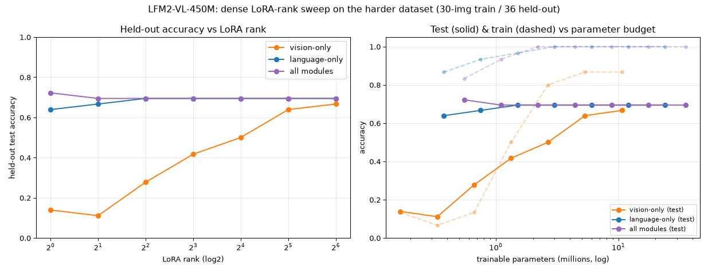

<!---
Copyright 2026 The HuggingFace Team. All rights reserved.

Licensed under the Apache License, Version 2.0 (the "License");
you may not use this file except in compliance with the License.
You may obtain a copy of the License at

    http://www.apache.org/licenses/LICENSE-2.0

Unless required by applicable law or agreed to in writing, software
distributed under the License is distributed on an "AS IS" BASIS,
WITHOUT WARRANTIES OR CONDITIONS OF ANY KIND, either express or implied.
See the License for the specific language governing permissions and
limitations under the License.
-->

# Does accuracy trace a continuous line as you add LoRA capacity?

The [ABLATION.md](./ABLATION.md) experiment compared families at one or two ranks. Here we
**densely sweep the LoRA rank** (`r ∈ {1, 2, 4, 8, 16, 32, 64}`) for each family, on a
deliberately **harder** dataset (`hard_dataset.py`: ~60 colors, ~17 shapes incl. pseudo-3D,
with per-instance color/size/position/rotation jitter so the classes *overlap* and the task
no longer saturates near 100%). The question: is accuracy-vs-capacity a smooth, continuous
curve — and where does each component plateau?

Reproduce (CPU-friendly but slow; results save incrementally so it is resume-safe):

```bash
python examples/lfm2_vl_finetuning/rank_sweep.py
```

## Results

Same 30-image training set and 36-image held-out set of **unseen combinations**, 6 epochs,
lr 2e-4, `lora_alpha = 2·r`. "train" = memorization, "test" = generalization.

| rank | vision-only test | language-only test | all-modules test |
| ---: | ---: | ---: | ---: |
| 1  | 14% | 64% | 72% |
| 2  | 11% | 67% | 69% |
| 4  | 28% | 69% | 69% |
| 8  | 42% | 69% | 69% |
| 16 | 50% | 69% | 69% |
| 32 | 64% | 69% | 69% |
| 64 | **67%** | **69%** | **69%** |

(trainable params range from 0.17M at vision r=1 to 35M at all-modules r=64.)



## Takeaways

**1. Yes — for the capacity-limited family it is a smooth, continuous curve.** `vision-only`
climbs monotonically 14% → 28% → 42% → 50% → 64% → 67% as the rank doubles. Each extra LoRA
dimension buys a bit more generalization; the points connect into a clean rising line. Its
*training* accuracy rises the same way (13% → 87%) and never reaches 100% even at r=64 — with
the language head frozen, the vision encoder is genuinely capacity-limited on this task.

**2. Language-only and all-modules are flat — they are *not* capacity-limited.** Both hit the
task ceiling (~69%) at **r = 1–4** and then stay flat out to r = 64, i.e. across a **~50–60×**
increase in trainable parameters (language: 0.37M → 24M; all: 0.55M → 35M). Spending more LoRA
budget there does nothing. So "continuous line" only shows up when capacity is the binding
constraint; once it is not, the curve is a horizontal plateau.

**3. There is a data-imposed ceiling (~69%) that no amount of capacity breaks.** With only 30
training images, generalization to unseen color·shape·relation combinations tops out around
69% — even all-modules at 35M params can't beat it. The bottleneck there is *data*, not model
capacity. (Earlier, on the easier dataset, this ceiling was ~88%.)

**4. Putting it together with the earlier analyses.** The leanest useful adapter is a *low-rank
language-only* one: `language-only r=4` reaches the ceiling with **1.5M** params, whereas
`vision-only` needs **10.6M** (r=64) just to get near it. This is the same lesson as the
weight-change analysis (adaptation concentrates in the language model) and the component
ablation (language ≫ vision per parameter), now traced out continuously across the whole
capacity axis.

> Caveat: small CPU-scale runs on a synthetic task at a fixed 6 epochs; absolute ceilings move
> with data/epochs/scale. The shapes of the curves — vision a rising line, language/all flat
> plateaus, a shared data ceiling — are the transferable lesson.
